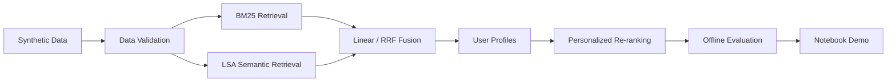

# PSR-SRS MVP — Personalized Search Ranking & Semantic Retrieval

A complete, locally-runnable MVP demonstrating **e-commerce personalized search
ranking and semantic retrieval** — from synthetic data generation through
multi-channel retrieval, user profiling, personalized re-ranking, and offline
evaluation.

> **Status**: MVP v0.1.0 — Complete and Verified.<br>
> **License**: MIT<br>
> **Tests**: 255 passed · Data Quality: 66/66 · Reproducibility: 5/5 · Frozen Metrics: 10/10

---

## Overview



The pipeline runs entirely locally — no web services, databases, or external
APIs required.

## Key Features

- **Configurable synthetic data generator** — items, users, queries, events,
  and qrels with realistic cascade browsing behavior
- **BM25 keyword retrieval** — Okapi weighting with deterministic tokenizer
- **LSA semantic retrieval** — TF-IDF + TruncatedSVD, 64-d latent space
- **Hybrid fusion** — Reciprocal Rank Fusion (RRF) and weighted linear
  combination with min-max normalization
- **Time-based train/test split** — session-level chronological split per user,
  verified zero leakage
- **User profiling** — weighted behavior events + exponential time decay
- **Personalized re-ranking** — category, brand, subcategory and price affinity
  over fixed Linear Hybrid Top-20 candidates
- **Cold-start fallback** — exact baseline order for users without behavioral
  history
- **Offline evaluation** — Precision@K, Recall@K, MRR@K, NDCG@K (qrels) +
  HitRate, Behavioral NDCG, Positive Recall (behavior)
- **Reproducibility verified** — same seed + same config = SHA-256 identical
  output across independent runs
- **Executable Notebook** — 18 chapters, cache and recompute modes, 0 errors

## Key Results

| Stage | NDCG@10 |
|-------|---------|
| BM25 | 0.297994 |
| LSA | 0.373320 |
| Linear Hybrid | 0.392327 |
| Personalized (qrels) | 0.396789 |

- Improved / Unchanged / Worsened: **2 / 61 / 1**
- Fallback exact match: **100%**
- Request candidate positive coverage: **9 / 65** (13.85%)
- Item positive recall: **17 / 143** (11.90%)

Behavioral NDCG gains from personalization are small (+0.0003). The primary
bottleneck is **candidate positive coverage** — re-ranking cannot surface
items that were never retrieved.

## Dataset Summary

All data is **synthetic**, generated with a fixed seed for perfect reproducibility.

| Entity | Count | File |
|--------|-------|------|
| Items | 500 | `data/sample/items.csv` |
| Users | 100 | `data/sample/users.csv` |
| Queries | 200 | `data/sample/queries.csv` |
| Events | 6,376 | `data/sample/events.csv` |
| Qrels | 10,076 | `data/sample/qrels.csv` |
| Configured sessions | 500 | — |
| Event sessions | 484 | — |
| Train / Test sessions | 400 / 84 | — |

## Quick Start

### Prerequisites

- **Python 3.12 or later** (tested on Windows 11)
- PowerShell
- The `python` command must reference a compatible Python interpreter.
  Verify with:

  ```powershell
  python --version
  python -m pip --version
  python -c "import sys; print(sys.executable)"
  ```

  If multiple Python versions are installed, use `py -3.12` or the full
  path to the desired interpreter in place of `python` in all commands below.

> **Note**: A virtual environment is optional. The commands below install
> dependencies directly into the Python environment referenced by `python`.

### 1. Install into the current Python environment

```powershell
python -m pip install --upgrade pip
python -m pip install -e ".[dev,notebook]"
```

Core dependencies: `scikit-learn==1.9.0` (transitive: `numpy`, `scipy`,
`joblib`, `threadpoolctl`, `narwhals`). Data generation uses Python standard
library; LSA retrieval and evaluation use sklearn/numpy/scipy.

### 2. Verify the installation

```powershell
python -c "import psr_srs_mvp; print('PSR-SRS-MVP import OK')"
python -m pip check
```

### 3. Run pipeline with pre-generated sample data

The repository includes frozen sample data in `data/sample/`. You can
run the full pipeline immediately:

```powershell
# BM25
python scripts\run_bm25.py --items data\sample\items.csv --queries data\sample\queries.csv --qrels data\sample\qrels.csv --config configs\bm25.json --output outputs\bm25

# LSA
python scripts\run_semantic.py --items data\sample\items.csv --queries data\sample\queries.csv --qrels data\sample\qrels.csv --config configs\semantic.json --bm25-metrics outputs\bm25\metrics.json --output outputs\semantic --comparison-output outputs\comparison\bm25_vs_semantic.json

# Hybrid Fusion
python scripts\run_fusion.py --items data\sample\items.csv --queries data\sample\queries.csv --qrels data\sample\qrels.csv --bm25-config configs\bm25.json --semantic-config configs\semantic.json --fusion-config configs\fusion.json --bm25-metrics outputs\bm25\metrics.json --semantic-metrics outputs\semantic\metrics.json --output outputs\hybrid --comparison-output outputs\comparison\retrieval_methods.json

# Personalized Re-ranking
python scripts\run_personalization.py --items data\sample\items.csv --users data\sample\users.csv --events data\sample\events.csv --qrels data\sample\qrels.csv --hybrid-results outputs\hybrid\linear\search_results.csv --config configs\personalization.json --output outputs\personalization --comparison-output outputs\comparison\hybrid_vs_personalized.json
```

### 4. Run tests

```powershell
python -m pytest -q
```

Expected: `255 passed`

## Full Local Reproduction

To regenerate data from scratch without overwriting the frozen baseline.
All outputs go to `outputs/reproduced/`.

```powershell
# 1. Generate synthetic data
python scripts\generate_data.py --config configs\sample.json --output data\reproduced --force

# 2. Validate the regenerated data
python scripts\validate_data.py --data-dir data\reproduced --statistics --manifest --output outputs\reproduced\data_quality_report.json

# 3. BM25 retrieval
python scripts\run_bm25.py --items data\reproduced\items.csv --queries data\reproduced\queries.csv --qrels data\reproduced\qrels.csv --config configs\bm25.json --output outputs\reproduced\bm25

# 4. LSA semantic retrieval
python scripts\run_semantic.py --items data\reproduced\items.csv --queries data\reproduced\queries.csv --qrels data\reproduced\qrels.csv --config configs\semantic.json --bm25-metrics outputs\reproduced\bm25\metrics.json --output outputs\reproduced\semantic --comparison-output outputs\reproduced\comparison\bm25_vs_semantic.json

# 5. Hybrid fusion
python scripts\run_fusion.py --items data\reproduced\items.csv --queries data\reproduced\queries.csv --qrels data\reproduced\qrels.csv --bm25-config configs\bm25.json --semantic-config configs\semantic.json --fusion-config configs\fusion.json --bm25-metrics outputs\reproduced\bm25\metrics.json --semantic-metrics outputs\reproduced\semantic\metrics.json --output outputs\reproduced\hybrid --comparison-output outputs\reproduced\comparison\retrieval_methods.json

# 6. Personalized re-ranking
python scripts\run_personalization.py --items data\reproduced\items.csv --users data\reproduced\users.csv --events data\reproduced\events.csv --qrels data\reproduced\qrels.csv --hybrid-results outputs\reproduced\hybrid\linear\search_results.csv --config configs\personalization.json --output outputs\reproduced\personalization --comparison-output outputs\reproduced\comparison\hybrid_vs_personalized.json
```

> **Frozen baseline**: `data/sample/` and `outputs/bm25/`, `outputs/semantic/`,
> `outputs/hybrid/`, `outputs/personalization/`, `outputs/comparison/` are the
> project's verified baselines. The commands above write to `data/reproduced/`
> and `outputs/reproduced/` to avoid overwriting them.
>
> The official seed is **20260614**. Same config + same seed = deterministic,
> SHA-256 identical output across independent runs.

## Notebook

The main Notebook (`notebooks/01_mvp_end_to_end.ipynb`) demonstrates the
full pipeline: 44 cells, 18 chapters, 16 code cells.

### Run interactively

```powershell
python -m jupyter notebook notebooks\01_mvp_end_to_end.ipynb
```

Then use **Kernel → Restart Kernel and Run All Cells** to execute.

### Cache mode (headless — uses pre-computed outputs)

```powershell
python -m nbconvert --to notebook --execute notebooks\01_mvp_end_to_end.ipynb --output 01_mvp_end_to_end.executed.ipynb --output-dir outputs\notebook --ExecutePreprocessor.timeout=600 --ExecutePreprocessor.kernel_name=python3
```

### Recompute mode (rebuilds all indices)

```powershell
$env:PSR_SRS_RECOMPUTE = "1"
python -m nbconvert --to notebook --execute notebooks\01_mvp_end_to_end.ipynb --output 01_mvp_end_to_end.recomputed.ipynb --output-dir outputs\notebook --ExecutePreprocessor.timeout=600 --ExecutePreprocessor.kernel_name=python3
Remove-Item Env:PSR_SRS_RECOMPUTE
```

**Both modes verified**: 16/16 code cells executed, 0 errors.

## Testing and Validation

```powershell
# Full test suite
python -m pytest -q                          # 255 passed

# Static checks
python -m compileall src scripts tests
python -m pip check                          # no broken requirements

# Data validation
python scripts\validate_data.py --data-dir data\sample
                                             # 66/66 checks
# Reproducibility
python scripts\reproducibility_check.py       # 5/5 SHA-256 matched

# Release Candidate check
python scripts\release_check.py              # 38/38 checks
```

The `release_check.py` script runs all validation steps and produces
`outputs/release/release_manifest.json`.

## Generated Outputs

| Directory | Contents |
|-----------|----------|
| `outputs/bm25/` | BM25 metrics, query metrics, search results |
| `outputs/semantic/` | LSA metrics, query metrics, search results |
| `outputs/hybrid/` | RRF + Linear fusion metrics and diagnostics |
| `outputs/personalization/` | User profiles, per-request metrics, diagnostics |
| `outputs/comparison/` | Method comparison reports (BM25-vs-LSA, retrieval methods, personalized) |
| `outputs/data_generation/` | Quality report, reproducibility report, manifest |
| `outputs/notebook/` | Executed and recomputed Notebooks, execution reports |

All outputs are reproducible given the same seed and configuration.

## Project Structure

```
PSR-SRS-MVP/
├── configs/                 # JSON configuration files
├── data/sample/             # Frozen sample data (5 CSV files)
├── docs/                    # Documentation (12 files)
├── notebooks/               # Main end-to-end Notebook
├── outputs/                 # Generated outputs (metrics, reports, comparisons)
├── scripts/                 # CLI entry points (9 scripts)
├── src/psr_srs_mvp/         # Source code
│   ├── data_generation/     # Synthetic data generator
│   ├── evaluation/          # Shared evaluation metrics
│   ├── personalization/     # Time split, profiles, re-ranking, eval
│   └── retrieval/           # BM25, LSA, fusion, tokenization, I/O
├── tests/                   # 5 test files, 255 tests
├── README.md
├── pyproject.toml
├── LICENSE
├── CHANGELOG.md
├── CONTRIBUTING.md
├── SECURITY.md
└── requirements-lock.txt
```

## Documentation

| Document | Topic |
|----------|-------|
| [`docs/architecture.md`](docs/architecture.md) | System architecture and module map |
| [`docs/data_generation.md`](docs/data_generation.md) | Data generation design and ER diagram |
| [`docs/synthetic_data_design.md`](docs/synthetic_data_design.md) | Detailed data design |
| [`docs/bm25_baseline.md`](docs/bm25_baseline.md) | BM25 retrieval baseline |
| [`docs/semantic_baseline.md`](docs/semantic_baseline.md) | LSA semantic retrieval |
| [`docs/hybrid_retrieval.md`](docs/hybrid_retrieval.md) | Hybrid fusion design |
| [`docs/personalized_reranking.md`](docs/personalized_reranking.md) | Personalized re-ranking |
| [`docs/reproducibility.md`](docs/reproducibility.md) | How to reproduce all results |
| [`docs/notebook_walkthrough.md`](docs/notebook_walkthrough.md) | Notebook chapter guide |
| [`docs/release_checklist.md`](docs/release_checklist.md) | Pre-release verification |
| [`docs/releases/v0.1.0.md`](docs/releases/v0.1.0.md) | v0.1.0 release notes |

## Reproducibility

| Check | Result |
|-------|--------|
| Same seed + config → identical CSV | 5/5 SHA-256 matched |
| Data quality | 66/66 checks passed |
| Frozen metrics | 10/10 matched (≤1e-6) |
| Notebook (cache) | 16/16 cells, 0 errors |
| Notebook (recompute) | 16/16 cells, 0 errors |
| Tests | 255 passed |
| Release Candidate | 38/38 checks |

## MVP Scope and Limitations

**This MVP includes**: local data generation, retrieval (BM25 + LSA), hybrid
fusion, user profiling, personalized re-ranking, offline evaluation, and an
executable Notebook.

**This MVP does not include**: web API, frontend, database, vector search
service, message queue, stream processing, online feature serving, A/B testing,
production deployment, or multi-user support.

**Known limitations**:

- Synthetic data only — not representative of real user behavior
- Small scale (500 items, 100 users, ~6k events)
- BM25 vocabulary limited to 76 unique terms
- Candidate positive coverage only 13.85%
- Fixed fusion and personalization weights (no Learning to Rank)
- No online A/B test or production latency benchmark
- Results do not demonstrate real-world business impact

## Enterprise-Level Boundary

The MVP is a **local-only research and demonstration project**. A future
Enterprise-level version would add:

- FastAPI service layer
- PostgreSQL with SQLAlchemy ORM
- OpenSearch for full-text search
- Qdrant for vector similarity search
- Redis for caching and session storage
- Docker containerization
- Online A/B testing framework
- Learning to Rank with real behavioral data

The Enterprise-level implementation is maintained as a separate project:
[PSR-SRS](https://github.com/yaoaoaoo/PSR-SRS)

## License

This project is licensed under the MIT License. See [LICENSE](LICENSE) for details.
