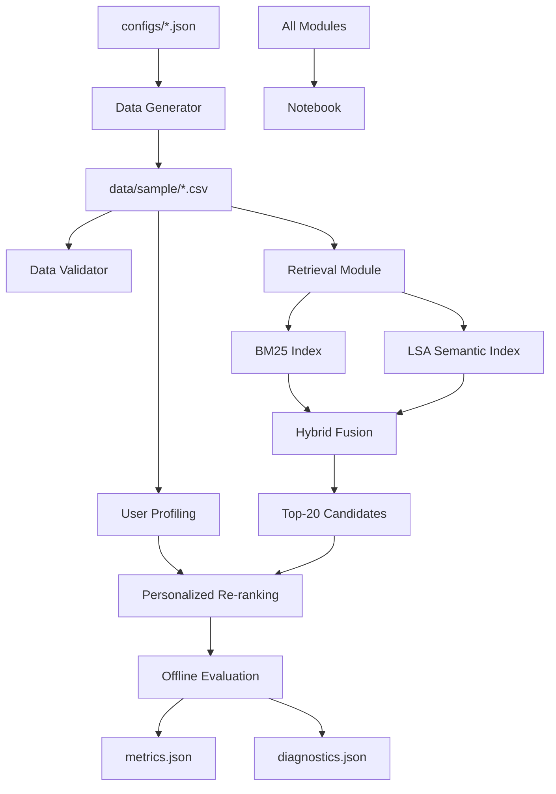

# Architecture — PSR-SRS MVP

## System Overview



## Module Map

| Module | Path | Purpose |
|--------|------|---------|
| Data Generation | `src/psr_srs_mvp/data_generation/` | Synthetic data: items, users, queries, events, qrels |
| Retrieval | `src/psr_srs_mvp/retrieval/` | BM25, LSA, Hybrid fusion, tokenization, I/O |
| Personalization | `src/psr_srs_mvp/personalization/` | Time split, user profiles, re-ranking, evaluation |
| Evaluation | `src/psr_srs_mvp/evaluation/` | Shared metrics (Precision, Recall, MRR, NDCG) |

## Data Flow

```
configs/sample.json       →  data/sample/*.csv
data/sample/items.csv     →  BM25 index, LSA vectors
data/sample/queries.csv   →  BM25/LSA search queries
data/sample/qrels.csv     →  retrieval evaluation labels
data/sample/events.csv    →  train/test split → user profiles
outputs/hybrid/linear/    →  fixed candidate set for personalization
```

## Key Design Decisions

1. **Seed-based reproducibility**: All randomness via `random.Random(20260614)`
2. **Inductive LSA**: TF-IDF and SVD fit only on items; queries are transformed
3. **Hybrid fusion before personalization**: Personalized re-ranking only re-orders fixed Top-20 candidates
4. **Time-based train/test split**: Session-level chronological split per user
5. **Cold-start fallback**: Users without behavioral history receive exact original ranking

## MVP vs Enterprise Boundary

| Concern | MVP | Enterprise |
|---------|-----|------------|
| Data | Synthetic, 500 items | Real production data |
| Retrieval | In-memory BM25/LSA | OpenSearch + Qdrant |
| Personalization | Rule-based affinity | Learning to Rank |
| Serving | CLI scripts | FastAPI endpoints |
| Storage | CSV files | PostgreSQL |
| Deployment | Local venv | Docker + Kubernetes |
| Evaluation | Offline metrics | Online A/B tests |
