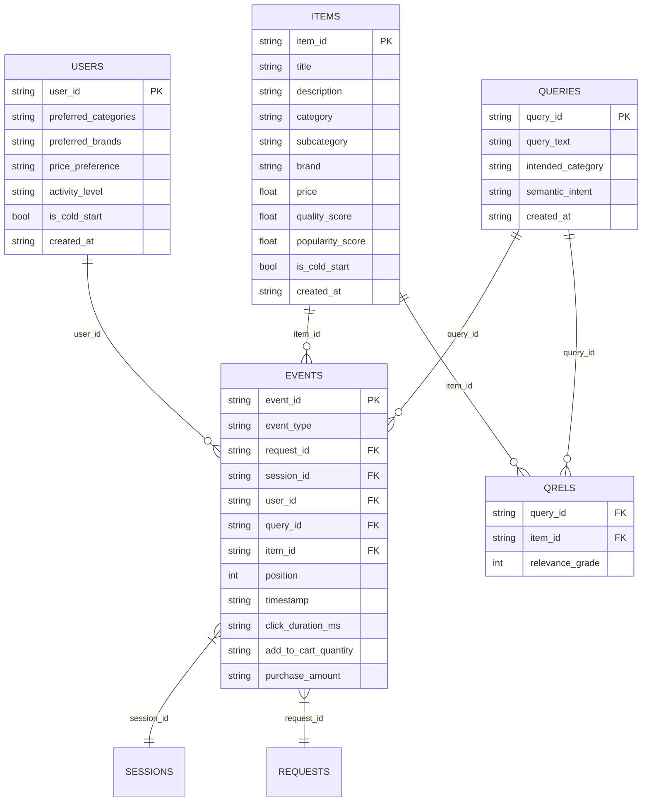

# Synthetic Data Generation — PSR-SRS MVP

> Version: 0.1.0 | Phase: Data Foundation

## 1. Overview

The data generator produces **synthetic e-commerce search behaviour data** for local
MVP development and algorithm validation. All data is deterministic given a fixed
seed and configuration — no external data sources, no network access.

## 2. Generated Entities



## 3. Generation Pipeline

```
configs/sample.json
    → GenerationConfig (typed dataclass)
    → DataGenerator (random.Random(seed))
        → generate_items()      [500 items, 10 categories, 50 subcategories]
        → generate_users()      [100 users, preferences + activity levels]
        → generate_queries()    [200 queries from template pool]
        → generate_events()     [cascade browsing model, 500 sessions]
        → generate_qrels()      [query-item relevance from text overlap]
    → write_csv_files()         [UTF-8 CSV with stable column order]
    → validate_generated_data() [structural + business rule checks]
```

### Key generation parameters

| Parameter | Default | Description |
|-----------|---------|-------------|
| `seed` | 20260614 | Controls all randomness |
| `num_items` | 500 | Product count |
| `num_users` | 100 | User count |
| `num_queries` | 200 | Search query count |
| `num_sessions` | 500 | Configured session count |
| `serp_size` | 20 | Results per search page |
| `cold_start_user_ratio` | 0.1 | Fraction of cold-start users |
| `cold_start_item_ratio` | 0.1 | Fraction of cold-start items |

### Cascade browsing model

Events are generated via session-based simulation:
1. User selected (weighted by activity_level)
2. Query selected (biased toward user preferences)
3. SERP built from relevant + diverse items
4. User browses positions 1→N sequentially
5. Click probability decays with position
6. After click: may stop browsing (post_click_stop_probability)
7. Max 3 clicks per request
8. Purchase ONLY after add_to_cart

## 4. Data Files

| File | Rows | Columns | Primary Key |
|------|------|---------|-------------|
| `items.csv` | 500 | 11 | `item_id` |
| `users.csv` | 100 | 7 | `user_id` |
| `queries.csv` | 200 | 5 | `query_id` |
| `events.csv` | 6,376 | 13 | `event_id` |
| `qrels.csv` | 10,076 | 3 | `(query_id, item_id)` |

### Nested fields

`preferred_categories` and `preferred_brands` in `users.csv` are JSON-encoded
string arrays. Parse with `json.loads(row["field_name"])`.

### Missing values

Numeric fields irrelevant to an event type are left empty:
- `click_duration_ms`: present only for `click`
- `add_to_cart_quantity`: present only for `add_to_cart`
- `purchase_amount`: present only for `purchase`

## 5. Session Accounting

| Statistic | Value | Explanation |
|-----------|-------|-------------|
| Configured sessions | 500 | `num_sessions` in config |
| Unique sessions in events | 484 | Sessions that generated ≥1 event |
| Zero-event sessions | 16 | Skipped due to activity_level probability |
| Train sessions (80/20 split) | 400 | 80% of 500 assigned |
| Test sessions | 84 | 20% of multi-session users' last sessions |

The 16 configured sessions without events are expected: the generator
probabilistically skips some cold-start user sessions.

## 6. User Grouping

All 100 users are covered by two mutually exclusive groupings:

**By session count:**
- Multi-session (≥2): 65
- Single-session: 22
- Zero-session (no events): 13
- **Total: 100**

**By profile status:**
- Warm (has positive train events): 81
- Cold-start flag: 4
- No positive behavior: 3
- No history: 12
- **Total: 100**

## 7. Candidate Coverage

The Linear Hybrid Top-20 is the **fixed candidate set** for personalization:

- **Request-level coverage**: 0.1385 (9/65 eligible requests)
- **Item-level recall**: 0.1190 (17/143 positive items)

This means **only 13.85% of test requests have at least one positive item
in their Top-20 candidates**. Personalization can only re-rank existing
candidates — it cannot surface items that were never retrieved.

## 8. Reproducibility

- **Seed**: `20260614` (configurable via `sample.json`)
- **RNG**: `random.Random(seed)` — fully isolated from global state
- **IDs**: Deterministic zero-padded counters (`item_000001`)
- **JSON**: `json.dumps(..., sort_keys=True, ensure_ascii=False)`
- **CSV**: Stable column order; UTF-8 encoding
- **Timestamps**: Generated from RNG, not system clock

**Same seed + same config = bit-identical CSV output** on any platform.

## 9. Commands

### Generate data

```bash
.venv/Scripts/python.exe scripts/generate_data.py \
    --config configs/sample.json \
    --output data/sample
```

With validation and manifest:

```bash
.venv/Scripts/python.exe scripts/generate_data.py \
    --config configs/sample.json \
    --output data/sample \
    --validate \
    --manifest outputs/data_generation/data_manifest.json
```

### Validate existing data

```bash
.venv/Scripts/python.exe scripts/validate_data.py \
    --data-dir data/sample \
    --statistics --manifest \
    --output outputs/data_generation/data_quality_report.json
```

### Run tests

```bash
.venv/Scripts/python.exe -m unittest discover -s tests -v
```

## 10. Usage in Notebook

```python
import csv
from pathlib import Path

def load_data(data_dir="data/sample"):
    """Load all generated CSVs."""
    data = {}
    for name in ("items", "users", "queries", "events", "qrels"):
        path = Path(data_dir) / f"{name}.csv"
        with path.open("r", encoding="utf-8", newline="") as f:
            data[name] = list(csv.DictReader(f))
    return data
```

Or use the project's built-in loaders from `psr_srs_mvp.retrieval.io`.

## 11. Known Limitations

1. **Synthetic data**: Generated by rule-based simulation, not real user behaviour
2. **Small scale**: 500 items, 100 users, ~6k events — sufficient for MVP, not production
3. **Low candidate coverage**: 13.85% — limits personalization evaluation
4. **Template vocabulary**: Item/query text uses fixed templates — limits BM25 recall
5. **No seasonality**: Flat time distribution over 3 months
6. **No position bias correction**: Low-rank clicks weighted same as high-rank
7. **Single geographic/linguistic setting**: English-only, no regional variation

## 12. Modifying Generation Parameters

1. Edit `configs/sample.json`
2. Run `scripts/generate_data.py` with new config
3. Run `scripts/validate_data.py` to verify quality
4. Re-run all downstream pipelines (BM25, LSA, Hybrid, Personalization)
5. Compare metrics against frozen baseline in this document

**Warning**: Changing the seed, entity counts, or behaviour parameters will
invalidate the current frozen baseline. All downstream outputs must be
regenerated.
